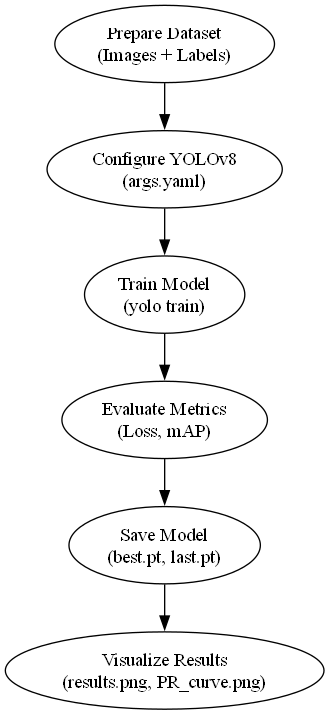
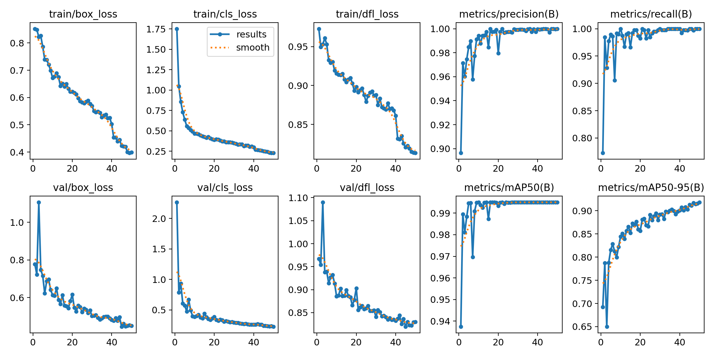
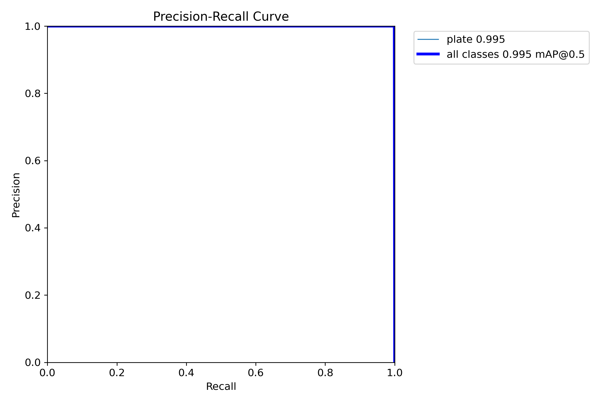
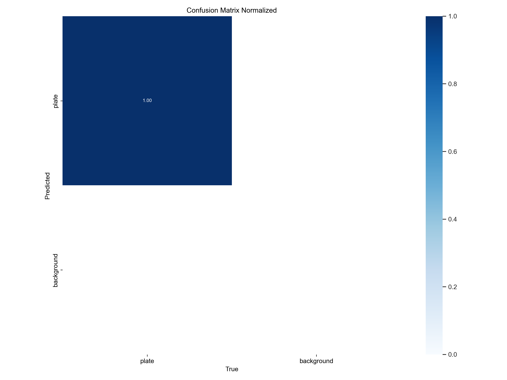
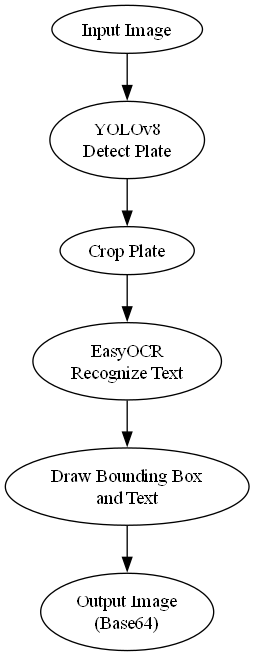
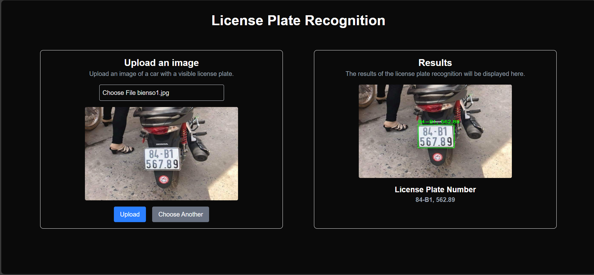

# Vietnamese License Plate Recognition

## Overview

This project uses YOLOv8 to detect license plates and EasyOCR to recognize text from images.

## Training Process

### Training Pipeline

### Training Results

#### Loss and Metrics

#### Precision-Recall Curve

#### Confusion Matrix

## API Pipeline

### Processing Flow

### Sample Output

### Run Project with dockercompose

Cd root project run docker-compose up -d --build
