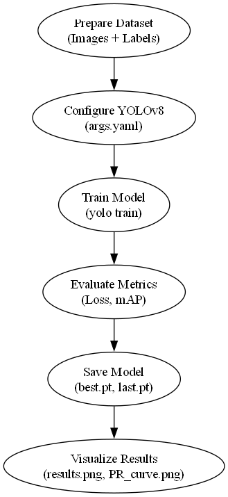
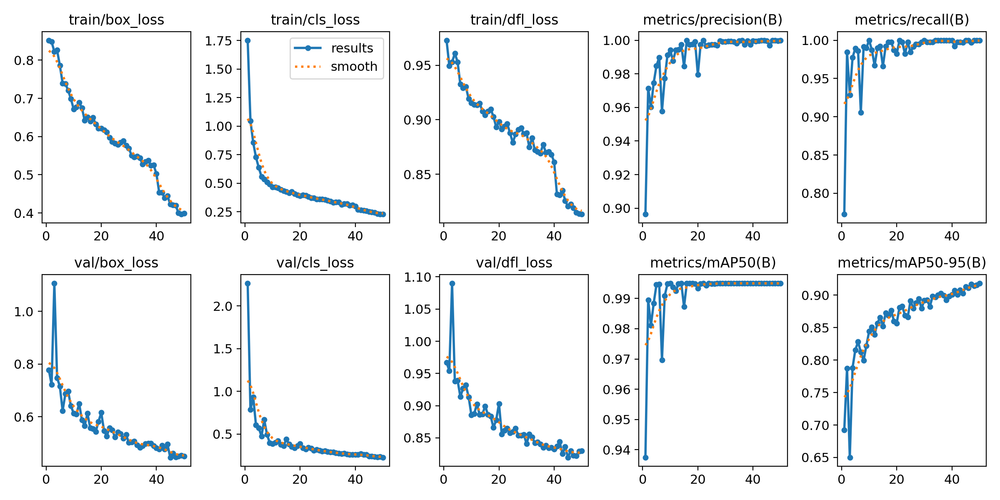
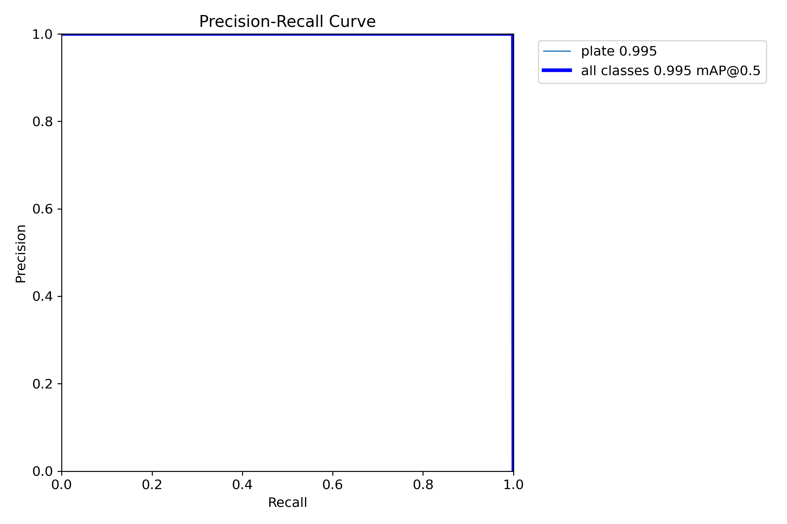
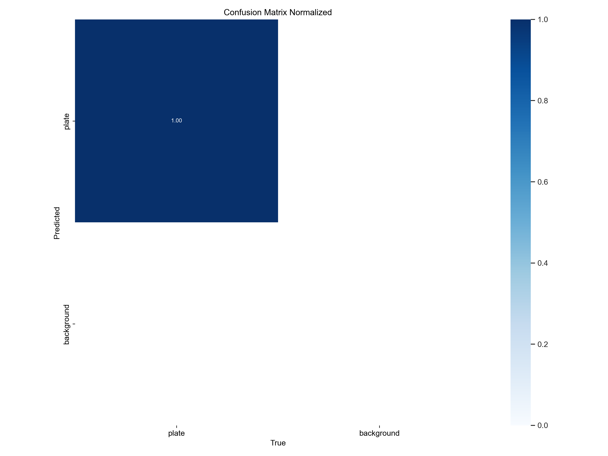
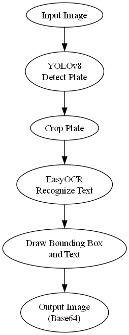
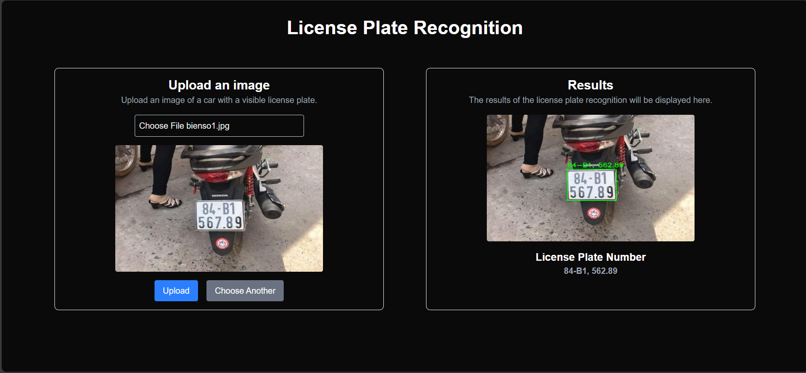

# 🚀 Vietnamese License Plate Recognition

This project uses YOLOv8 to detect license plates and EasyOCR to recognize text from images.

## ✨ Training Process

### 📈 Training Pipeline



### 📈 Training Results

#### Loss and Metrics



#### Precision-Recall Curve



#### Confusion Matrix



## 🔌 API Pipeline

### Processing Flow



### 📸 Screenshots



### 📁 Project Structure

```
root/
├── be/
│   ├── src/
│   │   ├── models/
|   |   ├── app/
|   |	├── data/
│   │   ├── reports/
│   │   └── utils/
│   ├── Dockerfile
│   └── requirements.txt
├── fe/
│   ├── src/
│   │   ├── app/
│   │   └── public/
│   ├── Dockerfile
│   └── package.json
├── docker-compose.yml
└── README.md
```

### 📦 Installation

```bash
git clone https://github.com/PhucHau0310/License-Plate-VN-Recognition.git
cd root project
docker-compose up -d --build
```

### 📜 License

This project is licensed under the MIT License.

### 👤 Author

-   GitHub: PhucHau0310
-   Email: haunhpr024@gmail.com
